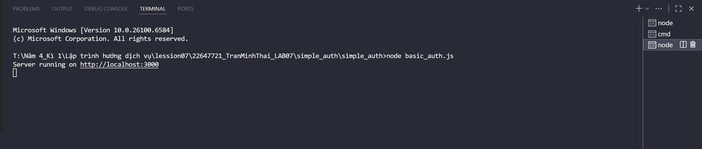
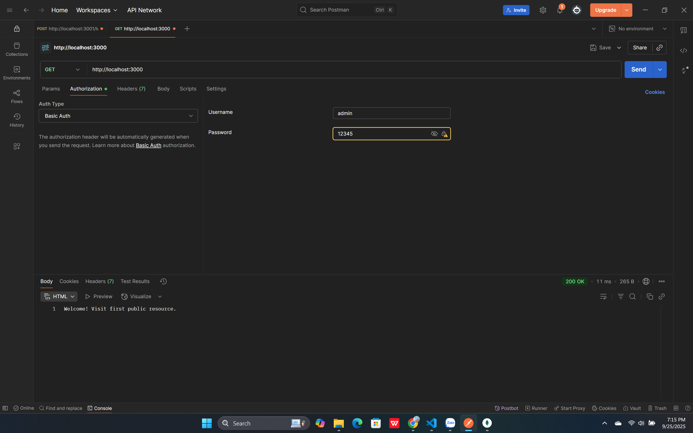
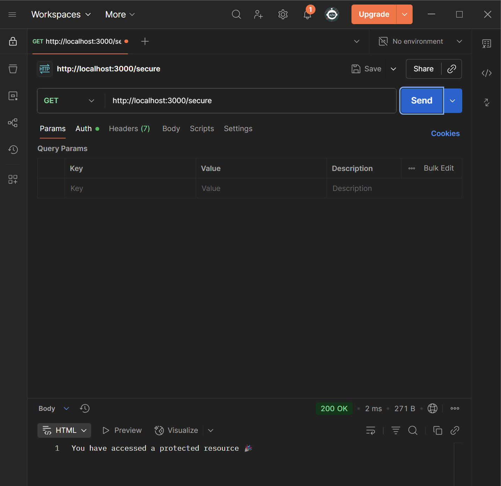
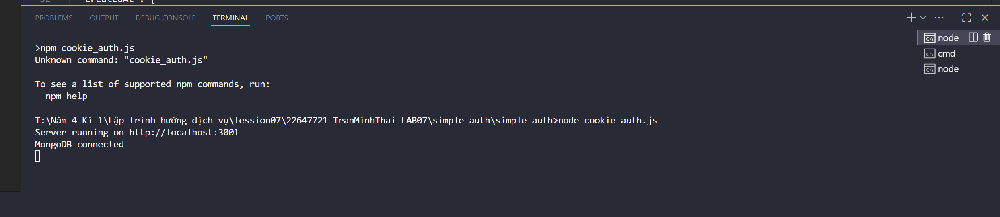
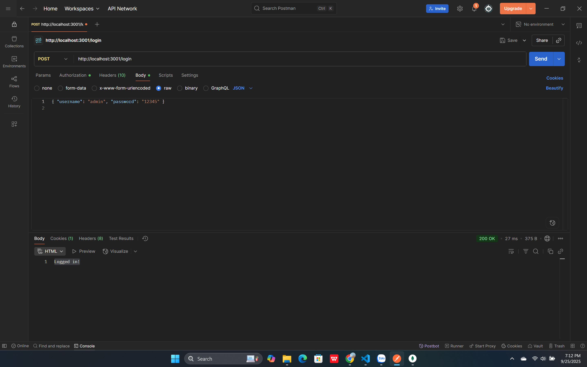

# Demo Basic Auth
## Cài đặt
1. Mở command Prompt
2. npm install
3. node basic_auth.js

## Test với POSTMAN 
4. Get: http://localhost:3000
5. Tab Auth → chọn Basic Auth → nhập username/password

6. GET: http://localhost:3000/secure

7. GET: http://localhost:3000/public

# Demo Cookie Auth
## Cài đặt
1. Mở command Prompt
2. npm install
3. node cookie_auth.js

## Test với POSTMAN 
4. POST: http://localhost:3001/login
5. Body -> raw -> nhập { "username": "admin", "password": "12345" } => thông báo thành công: Logged in!

6. Get: http://localhost:3001/profile

7. POST: http://localhost:3001/logout

## Test với MONGODB
8. Kết nối với localhost:27017
9. Chọn cookieApp -> cookies
10. hiện kết quả:

